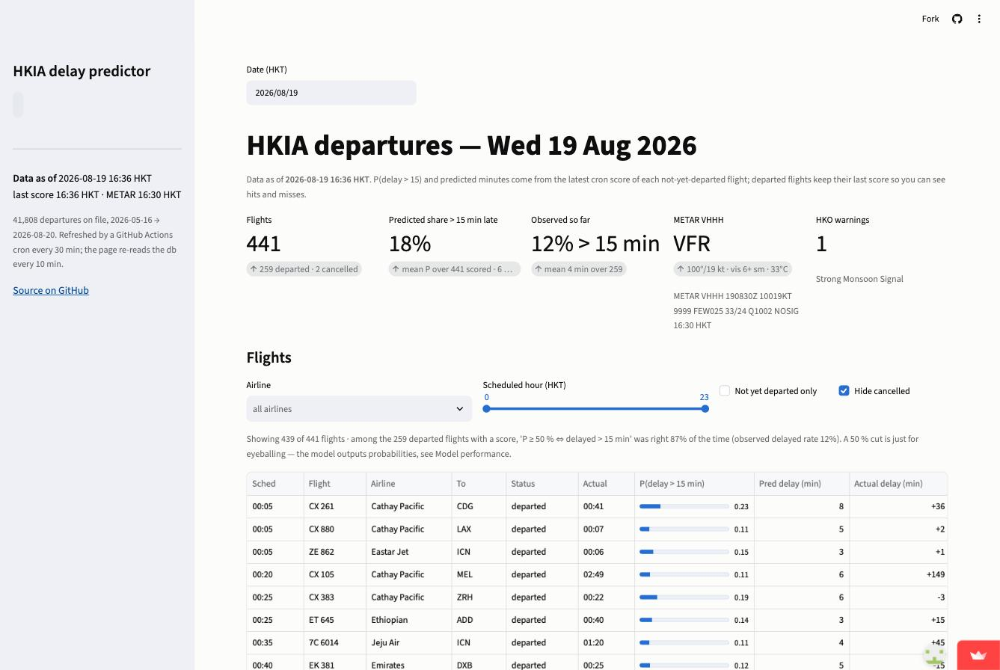

# HKIA Flight Delay Predictor

Predicting departure delays at Hong Kong International Airport from live flight and weather data — an ML-engineering showcase built on real, free, public data. **Live dashboard: https://hkia-delays.streamlit.app** — today's departures with delay predictions, 91-day delay patterns, and an honest model-performance page, refreshed automatically every ~30 minutes from GitHub Actions.

- **What**: for each HKIA passenger departure, predict P(delay > 15 min) / expected delay minutes, served on a public dashboard with honest evaluation numbers. v1 = departures only.
- **Data** (3 sources, all free): Airport Authority flight info API via data.gov.hk (scheduled vs actual departure = label; ~91-day rolling history), Hong Kong Observatory open data (current readings, warnings incl. typhoon signals), METAR for VHHH from aviationweather.gov. OpenSky ADS-B is a deferred stretch.
- **Architecture** (cron → ingest → predict → db → api): GitHub Actions every 30 min (`ingest.yml`, $0) runs `src/hkia/ingest_*.py` (flights incl. tomorrow's schedule, HKO readings/warnings, live METAR) into SQLite `data/hkia.db`, then `predict.py` scores every not-yet-departed flight for today + tomorrow with the models in `models/` and appends to table `predictions` (re-scored only when the feature vector changes; history kept). A daily job (`backfill.yml`) runs `backfill_weather.py` (incremental IEM METAR history + HKO typhoon-signal db) and `evaluate.py` (last score before departure vs actual → `reports/live-eval.md`). `features.py` is the single feature builder for training and inference (33 features, point-in-time rolling stats, as-of weather join); `train.py` fits baselines + XGBoost on a date-ordered split → `models/`, `reports/M2-results.md`. `api.py` (FastAPI, read-only over the DB) serves the schedule + latest predictions; `app/streamlit_app.py` (Streamlit) is the public dashboard reading the same DB.
- **Headline numbers (test = last 14 days, 2026-08-03..16, 6,252 departures)**: P(delay > 15 min) AUC **0.661** (XGBoost) vs 0.623 (airline x hour baseline) vs 0.50 (global rate); log loss 0.575 / 0.585 / 0.604. Delay-minutes MAE **16.6** vs 18.5 (baseline) vs 17.4 (train median). Airline + destination + time of day explain most; weather adds ~+0.013 AUC; the point-in-time rolling delay features do not help AUC on test. Full tables, calibration and ablations: `reports/M2-results.md`; feature dictionary: `docs/features.md`.
- **Recon findings**: see `docs/M0-data-recon.md` (URLs, fields, historical depth, gotchas). Headline: ~450 departures/day, 91 days back → ~40k labelled departures on first backfill.

## Run
```
python3 -m venv .venv && .venv/bin/pip install -e .      # runtime (requirements.txt) + ML deps (requirements-ml.txt); needs libomp on macOS for xgboost (brew install libomp)
.venv/bin/python scripts/ingest_all.py --backfill        # first time: whole ~91-day window (~2 min)
.venv/bin/python scripts/ingest_all.py                   # yesterday/today/tomorrow + weather; idempotent
.venv/bin/python -m hkia.backfill_weather                # IEM METAR history + HKO TC signals -> metar_hist, tc_signals (~2 min, retries on IEM 503)
.venv/bin/python -m hkia.features                        # -> data/features.parquet (not committed)
.venv/bin/python -m hkia.train                           # -> models/*.joblib, models/MANIFEST.json, reports/M2-results.md
.venv/bin/python -m hkia.predict                         # score today+tomorrow -> table predictions (what the cron does every 30 min)
.venv/bin/python -m hkia.evaluate                        # predictions vs actuals, rolling 7 days -> reports/live-eval.md
.venv/bin/uvicorn hkia.api:app --reload                  # http://127.0.0.1:8000/docs
.venv/bin/streamlit run app/streamlit_app.py            # dashboard, http://localhost:8501 (needs only requirements.txt)
.venv/bin/python -m pytest -q                            # feature-builder tests (leakage, as-of join, congestion) + API/eval tests on a fixture db + dashboard AppTest smoke tests
```
`requirements.txt` is the light runtime set (pandas, numpy, streamlit, plotly, fastapi, uvicorn) that Streamlit Cloud installs; `requirements-ml.txt` adds what the ingestion / training / scoring jobs need (xgboost, scikit-learn, pyarrow, requests, …) and is what the Actions workflows install.
The committed `data/hkia.db` carries the live tables, the weather backfill tables and `predictions` (all written by the Actions jobs).

### API (`uvicorn hkia.api:app`)
| endpoint | returns |
|---|---|
| `GET /health` | db path, table counts, freshness of flights / METAR / predictions |
| `GET /departures?date=YYYY-MM-DD` | HKT day's departures: schedule, status (`scheduled`/`departed`/`cancelled`), actual delay, latest prediction (`p_delay15`, `pred_delay_min`, `model_version`, `scored_at`) |
| `GET /flight/{flight_no}?date=` | one flight (`CX 255` or `cx255`) incl. its full prediction history for the day |
| `GET /model` | `models/MANIFEST.json` + rolling live-evaluation numbers (honest "not enough matured predictions yet" until the cron has run for a while) |
| `GET /weather/latest` | latest METAR + latest HKO current readings and warnings |

### Dashboard (`streamlit run app/streamlit_app.py`)
Four pages, HKT everywhere, "data as of" (last ingest) in the sidebar; reads `data/hkia.db` + `models/` + `reports/` directly, never scores.

| page | shows |
|---|---|
| Today's departures | date picker (today / tomorrow / back 90 days), summary tiles (flights, predicted share > 15 min late, observed so far, current METAR, HKO warnings / TC signal), filterable table (airline, hour range, not-yet-departed) with P(delay > 15) as a progress bar, predicted minutes and — for departed flights — the actual delay and a hit/miss mark; predicted-vs-observed by hour |
| Delay patterns | 91-day history: hour x day-of-week heatmap (mean delay or % > 15), airline table (n ≥ 50), top destinations, typhoon-days callout (mean delay on TC-signal days vs the rest), mean delay per day |
| Model performance | M2 test metrics (baselines vs XGBoost) from `models/MANIFEST.json`, calibration plot, gain feature importance (`models/feature_importance.json`), ablation, **live evaluation** (rolling 7-day AUC/Brier/MAE once ≥ 100 matured predictions, "collecting — N so far" until then), how-to-read + limitations |
| About | 10-line architecture, data sources, repo, author |

Deploy: Streamlit Community Cloud from `main`, main file `app/streamlit_app.py` — exact steps in [`docs/deploy.md`](docs/deploy.md). Because the bot commits the DB every 30 min, each commit redeploys the app with fresh data. Live: https://hkia-delays.streamlit.app



## Known limitations
- Live scoring uses the **latest METAR observation** as the weather for every future flight (persistence, `metar_age_min` capped at 3 h) — not a forecast; TAF is a stretch. Rolling delay features for future flights only see flights that have departed as of scoring time, a slightly narrower history than at training time.
- The API is read-only over the SQLite file; predictions come from the cron, so between runs (30 min) they can be up to 30 min stale (`/health` shows `predictions_last_scored_at`). The dashboard is ready to deploy on Streamlit Community Cloud (`docs/deploy.md`); the API is not deployed in v1.
- `predictions` keeps history (one row per flight per run whose features changed), which grows the DB by roughly a few hundred KB/day on top of the flights churn — another reason to move off DB-in-git.
- The SQLite file is committed back to the repo by the Actions cron; at ~8 MB and growing this will bloat git history — migrate to Postgres/Supabase (or artifact storage) before it hurts.
- HKO current readings/warnings only accrue from 2026-08-15; historical METAR comes from the IEM ASOS archive (hourly) and typhoon-signal history from HKO's warning database (`docs/features.md`).
- 93 days of data in one season; the only typhoon (Noul, 25-26 Jul) falls in the validation split, so weather/typhoon effects are learned from a handful of days and unconfirmed on test. Numbers will move as data accrues — retrain and re-read the report before quoting them.
