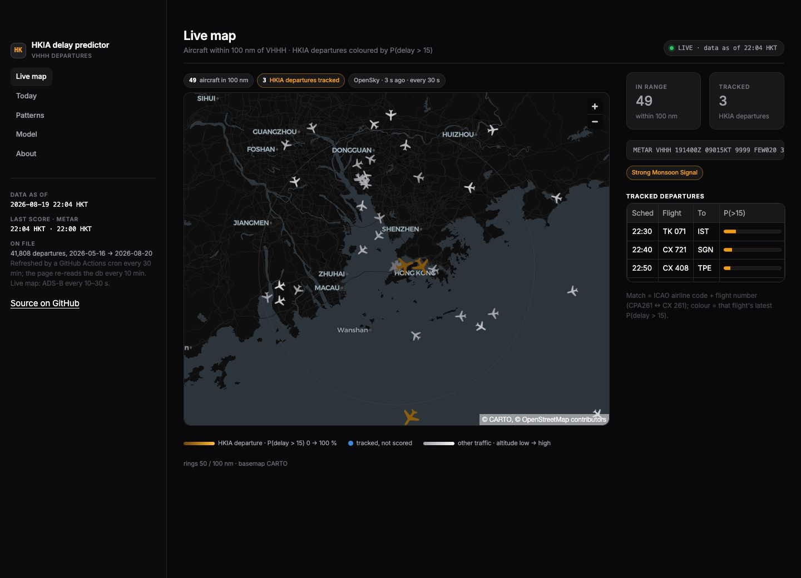
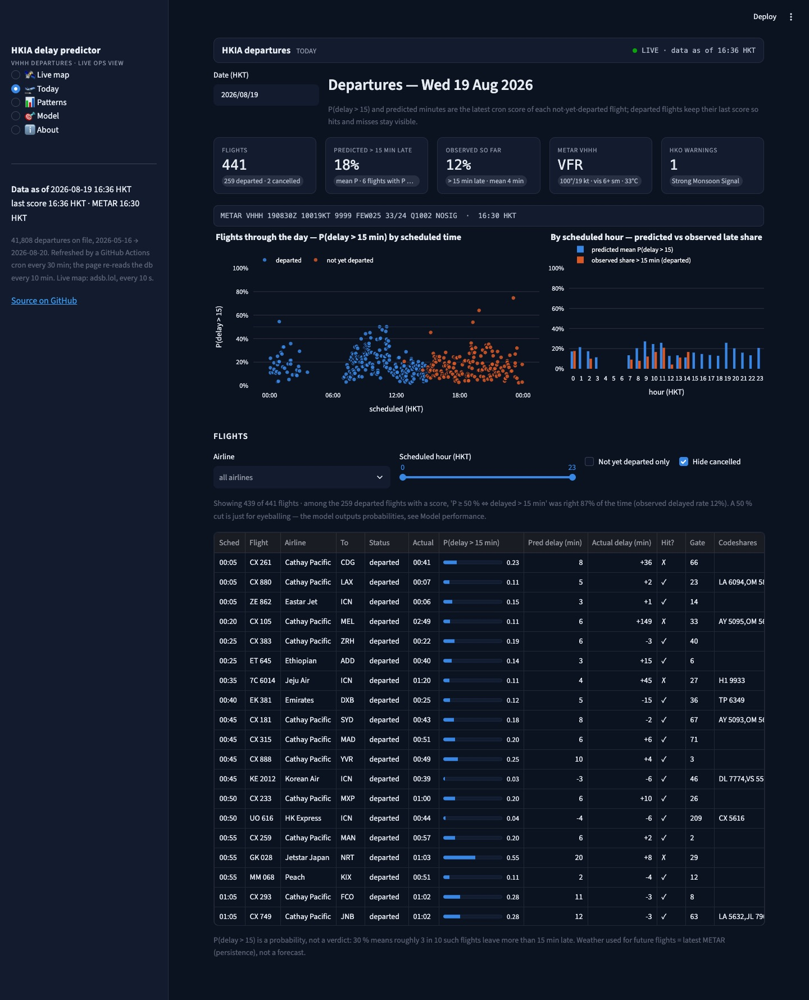
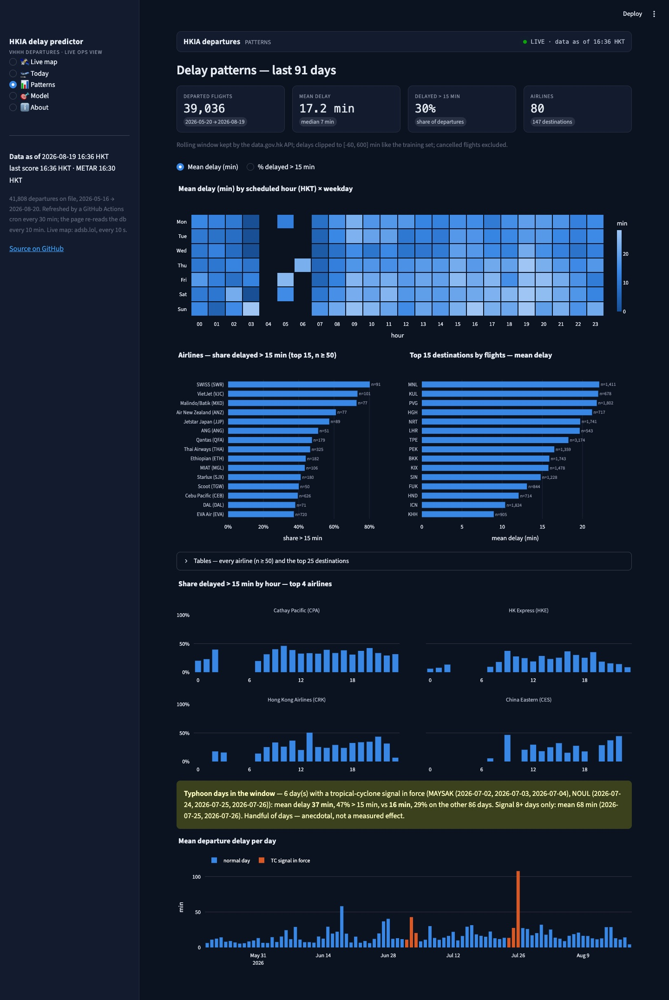
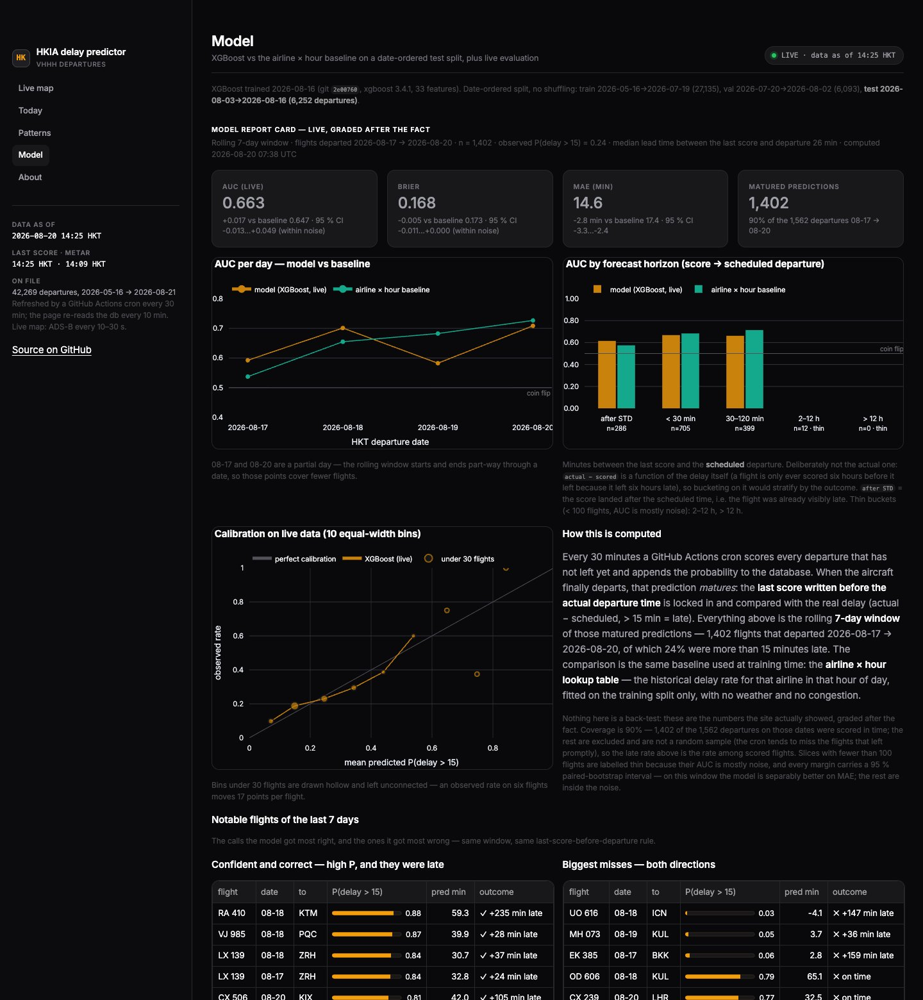
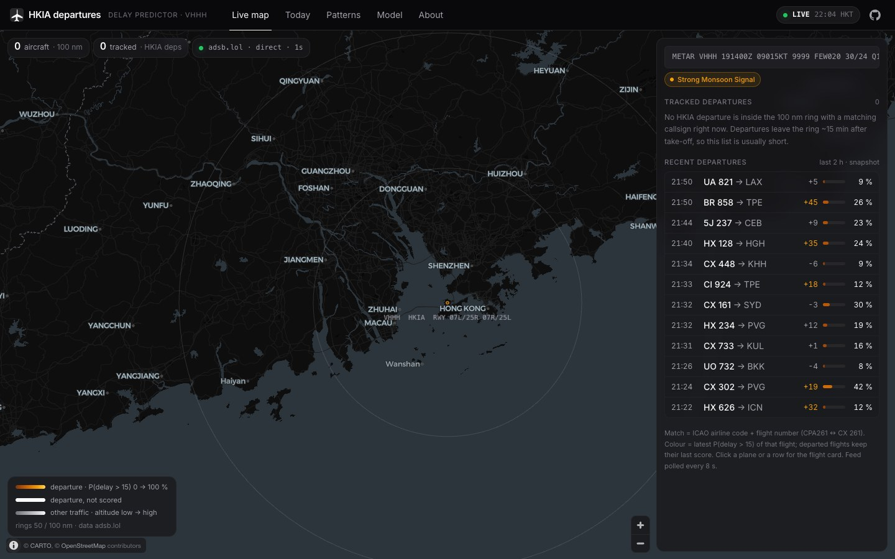
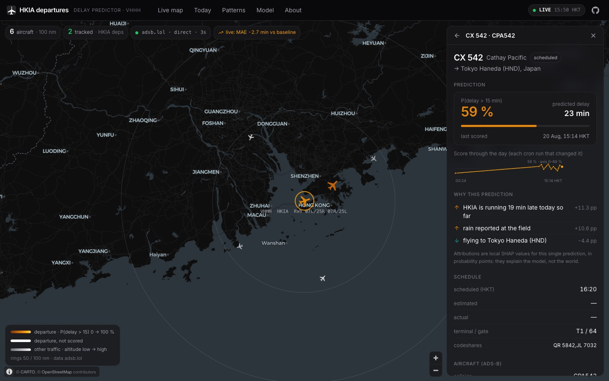
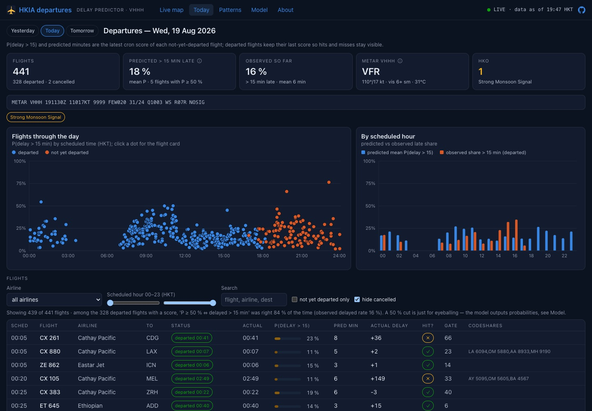
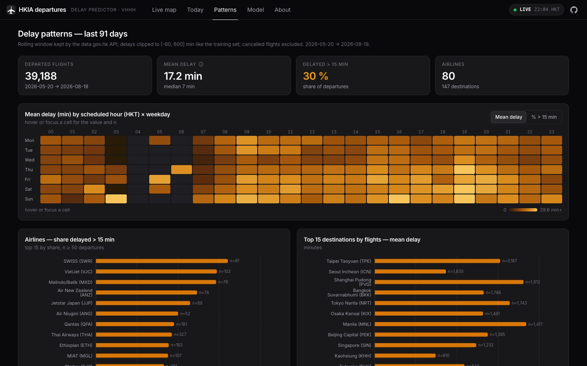
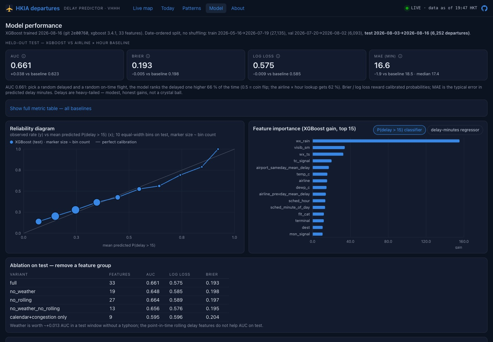

# HKIA Flight Delay Predictor

Predicting departure delays at Hong Kong International Airport from live flight and weather data — an ML-engineering showcase built on real, free, public data. **Live web app: https://dsjwong.github.io/hkia-delay-predictor/** (static React, GitHub Pages) · **Streamlit dashboard: https://hkia-delays.streamlit.app** (fallback) — a live aircraft map around HKIA (ADS-B) with today's departures highlighted by predicted delay, today's departures with delay predictions, 91-day delay patterns, and an honest model-performance page, refreshed automatically every ~30 minutes from GitHub Actions.

> **In production the model beats the airline × hour baseline: AUC 0.663 vs 0.647 over the last 7 days, n = 1,402 matured predictions — see the live report card** ([web app](https://dsjwong.github.io/hkia-delay-predictor/#/model) · [Streamlit](https://hkia-delays.streamlit.app/?page=Model) · [`reports/live-eval.md`](reports/live-eval.md)). Not a back-test: for every flight that has since departed, the *last probability the site published before it left*, graded against what actually happened. The margin is modest (+0.017 AUC, Brier −0.005, MAE −2.8 min) over a lookup table, and the window is only a few days long — the point is that the model grades itself in public and shows the slices where it does badly.

- **What**: for each HKIA passenger departure, predict P(delay > 15 min) / expected delay minutes, served on a public dashboard with honest evaluation numbers. v1 = departures only.
- **Data** (3 sources, all free): Airport Authority flight info API via data.gov.hk (scheduled vs actual departure = label; ~91-day rolling history), Hong Kong Observatory open data (current readings, warnings incl. typhoon signals), METAR for VHHH from aviationweather.gov. OpenSky ADS-B is a deferred stretch.
- **Architecture** (cron → ingest → predict → db → api / JSON → static site): GitHub Actions every 30 min (`ingest.yml`, $0) runs `src/hkia/ingest_*.py` (flights incl. tomorrow's schedule, HKO readings/warnings, live METAR) into SQLite `data/hkia.db`, then `predict.py` scores every not-yet-departed flight for today + tomorrow with the models in `models/` and appends to table `predictions` (re-scored only when the feature vector changes; history kept), then `export_json.py` writes the JSON snapshots the web app reads. A daily job (`backfill.yml`) runs `backfill_weather.py` (incremental IEM METAR history + HKO typhoon-signal db) and `evaluate.py` (last score before departure vs actual → `reports/live-eval.md`). `features.py` is the single feature builder for training and inference (33 features, point-in-time rolling stats, as-of weather join); `train.py` fits baselines + XGBoost on a date-ordered split → `models/`, `reports/M2-results.md`. `api.py` (FastAPI, read-only over the DB) serves the schedule + latest predictions; `app/streamlit_app.py` (Streamlit) is the public dashboard reading the same DB.
- **Headline numbers (test = last 14 days, 2026-08-03..16, 6,252 departures)**: P(delay > 15 min) AUC **0.661** (XGBoost) vs 0.623 (airline x hour baseline) vs 0.50 (global rate); log loss 0.575 / 0.585 / 0.604. Delay-minutes MAE **16.6** vs 18.5 (baseline) vs 17.4 (train median). Airline + destination + time of day explain most; weather adds ~+0.013 AUC; the point-in-time rolling delay features do not help AUC on test. Full tables, calibration and ablations: `reports/M2-results.md`; feature dictionary: `docs/features.md`.
- **Live numbers (rolling 7 days, 2026-08-17..20, 1,402 matured predictions)**: AUC **0.6635** (model) vs 0.6466 (airline × hour baseline) vs 0.50 (naive); Brier 0.1681 vs 0.1734; log loss 0.5148 vs 0.5271; delay-minutes MAE **14.6** vs 17.4. Median lead time between the last score and the actual departure: 25.6 min. Honest about the slices: per day the model ranges 0.58–0.71 and is *behind* the baseline on 2 of the 4 days so far; by lead time it is 0.697 under 30 min out and 0.619 at 30–120 min (n = 811 / 560), and the > 12 h bucket is empty because a flight is almost always re-scored closer in. Full breakdown, live calibration and the notable calls: `reports/live-eval.md` and the report card in both apps.
- **Recon findings**: see `docs/M0-data-recon.md` (URLs, fields, historical depth, gotchas). Headline: ~450 departures/day, 91 days back → ~40k labelled departures on first backfill.

## Run
```
python3 -m venv .venv && .venv/bin/pip install -e .      # runtime (requirements.txt) + ML deps (requirements-ml.txt); needs libomp on macOS for xgboost (brew install libomp)
.venv/bin/python scripts/ingest_all.py --backfill        # first time: whole ~91-day window (~2 min)
.venv/bin/python scripts/ingest_all.py                   # yesterday/today/tomorrow + weather; idempotent
.venv/bin/python -m hkia.backfill_weather                # IEM METAR history + HKO TC signals -> metar_hist, tc_signals (~2 min, retries on IEM 503)
.venv/bin/python -m hkia.features                        # -> data/features.parquet (not committed)
.venv/bin/python -m hkia.train                           # -> models/*.joblib, models/MANIFEST.json, reports/M2-results.md
.venv/bin/python -m hkia.predict                         # score today+tomorrow -> table predictions (what the cron does every 30 min)
.venv/bin/python -m hkia.evaluate                        # predictions vs actuals, rolling 7 days (+ daily / lead-time / calibration / notable slices) -> reports/live-eval.md
.venv/bin/python -m hkia.export_json                     # JSON snapshots for the static web app -> web/public/data/ (what the cron does after predict)
.venv/bin/uvicorn hkia.api:app --reload                  # http://127.0.0.1:8000/docs
.venv/bin/streamlit run app/streamlit_app.py            # dashboard, http://localhost:8501 (needs only requirements.txt)
.venv/bin/python -m pytest -q                            # feature-builder tests (leakage, as-of join, congestion) + API/eval tests on a fixture db + dashboard AppTest smoke tests
```
`requirements.txt` is the light runtime set (pandas, numpy, streamlit, plotly, pydeck, requests, fastapi, uvicorn) that Streamlit Cloud installs; `requirements-ml.txt` adds what the ingestion / training / scoring jobs need (xgboost, scikit-learn, pyarrow, requests, …) and is what the Actions workflows install.
The committed `data/hkia.db` carries the live tables, the weather backfill tables and `predictions` (all written by the Actions jobs).

### API (`uvicorn hkia.api:app`)
| endpoint | returns |
|---|---|
| `GET /health` | db path, table counts, freshness of flights / METAR / predictions |
| `GET /departures?date=YYYY-MM-DD` | HKT day's departures: schedule, status (`scheduled`/`departed`/`cancelled`), actual delay, latest prediction (`p_delay15`, `pred_delay_min`, `model_version`, `scored_at`) |
| `GET /flight/{flight_no}?date=` | one flight (`CX 255` or `cx255`) incl. its full prediction history for the day |
| `GET /model` | `models/MANIFEST.json` + the rolling live-evaluation numbers, including the report-card slices (daily series, lead-time buckets, live calibration, notable flights, baseline deltas); still honest with "not enough matured predictions yet" on a fresh database |
| `GET /weather/latest` | latest METAR + latest HKO current readings and warnings |

### Dashboard (`streamlit run app/streamlit_app.py`)
Five pages in a neutral zinc-dark design system (shadcn/ui-style tokens, Inter, one amber accent for P(delay) — see [`docs/design.md`](docs/design.md)), HKT everywhere, "data as of" (last ingest) in the title row and sidebar; reads `data/hkia.db` + `models/` + `reports/` directly, never scores. Code: `app/streamlit_app.py` (shell), `app/theme.py` (palette, CSS, shared plotly template), `app/charts.py`, `app/live_map.py`, `app/page_*.py`.

| page | shows |
|---|---|
| Live map (landing) | every aircraft within 100 nm of VHHH from a free ADS-B provider chain — [adsb.lol](https://api.adsb.lol/) → [OpenSky](https://opensky-network.org/) anonymous bbox → [adsb.fi](https://adsb.fi/) → [airplanes.live](https://airplanes.live/), first non-empty wins (adsb.lol returns an empty list from Streamlit Cloud's egress IP, so OpenSky usually serves there; refresh 10 s for the readsb family, 30 s for OpenSky; status badge names the provider + fetch age, last good frame kept when everything is empty; plane icons rotated by track, zinc→white by altitude), with **today's HKIA departures highlighted** — matched by ICAO airline code + flight number (`CPA261` ↔ `CX 261`), coloured by their latest P(delay > 15) on an amber ramp, tooltip with flight / destination / sched / actual / P / predicted minutes; side panel with counts, tracked-departure table, METAR + HKO warning strip; falls back to the last good frame if the feed is down |
| Today | date picker (today / tomorrow / back 90 days), metric tiles (flights, predicted share > 15 min late, observed so far, METAR, HKO warnings / TC signal), timeline strip of every scored flight (scheduled time × P, departed vs pending), predicted-vs-observed late share by hour, filterable table (airline, hour range, not-yet-departed) with P(delay > 15) as a progress bar, predicted minutes and — for departed flights — actual delay and a hit/miss mark |
| Patterns | 91-day history: hour × weekday heatmap (mean delay or % > 15), ranked bars for airlines (share > 15, n ≥ 50, top 15) and top destinations (mean delay), small multiples of delay by hour for the top 4 airlines, typhoon-days callout, mean delay per day with TC-signal days highlighted; full tables in an expander |
| Model | leads with the **live report card** — AUC / Brier / MAE tiles with the signed delta against the airline × hour baseline, AUC per day (model vs baseline), AUC by lead-time bucket, calibration on live data, and the notable flights of the week (most confident correct calls, biggest misses in both directions) — then the M2 held-out test metrics, reliability diagram, gain feature importance, ablation, the full live metric table and limitations |
| About | 10-line architecture, data sources, repo, author |

Palette (validated with the dataviz skill's `validate_palette.js` on the `#09090b` surface): categorical `#c9820c #3d87e0 #14a88d #9b6fe0` (adjacent pairs PASS, worst CVD ΔE 14.0; first three all-pairs PASS), P(delay) amber ramp `#6b4608 → #ffbf3d` (ordinal PASS), heatmap zinc ramp `#45454c → #ececef` (PASS); status colours reserved for badges. Amber = the model's prediction, zinc = observed / other.

Deploy: Streamlit Community Cloud from `main`, main file `app/streamlit_app.py` — exact steps in [`docs/deploy.md`](docs/deploy.md). Because the bot commits the DB every 30 min, each commit redeploys the app with fresh data. Live: https://hkia-delays.streamlit.app

Live map data: community ADS-B feeds (adsb.lol, OpenSky, adsb.fi, airplanes.live — free, no key; display only — not a model input). Basemap © [CARTO](https://carto.com/attributions) © OpenStreetMap contributors.






## Web app (GitHub Pages) — https://dsjwong.github.io/hkia-delay-predictor/
A static React app in `web/` (Vite + React 19 + TypeScript + Tailwind 4, shadcn-style primitives, Inter, MapLibre GL + deck.gl, Recharts),
hosted on GitHub Pages with **no backend**: the same five pages as the Streamlit dashboard (Live map · Today · Patterns · Model · About — the
Model route leads with the live report card, and the Live map header carries a chip with the current live margin that links to it) in a
neutral zinc dark design system — amber reserved for P(delay > 15), floating glass panels over a full-height live map, KPI tiles + card grids
elsewhere — hash-routed, mobile-responsive (bottom tabs), keyboard-accessible, skeleton/empty states and tooltips everywhere. Tokens, type
scale, colour meaning and the library decision: [`docs/design.md`](docs/design.md).

**Architecture: cron → JSON → static site.** Every ingest run ends with `python -m hkia.export_json`, which writes compact snapshots
(~600 KB total) to `web/public/data/` — `meta.json` (data-as-of, last score/METAR, counts, airline names, IATA→ICAO map, airport cities),
`departures_{yesterday,today,tomorrow}.json` (every flight + latest prediction + a short prediction history), `patterns.json` (hour × weekday
heatmap, airline/destination tables, daily series with TC-signal flags, typhoon stats), `model.json` (M2 metrics, calibration bins, feature
importance, ablation, the whole live report card under `live_eval` — headline metrics, daily series, lead-time buckets, live calibration,
notable flights, baseline deltas — interpretation, limitations; 11 KB), `weather.json` (latest METAR, HKO warnings, TC signal) — and commits
them with the DB. The deployed page fetches those files straight from `raw.githubusercontent.com/…/main/web/public/data/` (CORS `*`, 5-min CDN
cache), so **fresh data needs no rebuild**; the copy bundled into the Pages artifact under `/data/` is the offline fallback. `pages.yml` rebuilds
and deploys only when `web/**` changes in a human push (bot pushes with `GITHUB_TOKEN` never trigger workflows — by design here).

**Live aircraft** are fetched client-side from the free [adsb.lol](https://adsb.lol) community ADS-B feed
(`/v2/lat/22.308/lon/113.918/dist/100`), dead-reckoned between polls (ground speed + track) so the icons glide, matched to HKIA departures by
ICAO airline code + flight number (`CPA261` ↔ `CX 261`; map built from the db and `src/hkia/airlines.py`), coloured on the validated amber ramp
by P(delay > 15), with 50/100 nm rings, hover tooltips and a click-to-open flight card (prediction, schedule vs actual, destination, prediction
history sparkline, aircraft reg/type/altitude/speed). **CORS caveat:** adsb.lol (and adsb.fi / airplanes.live / anonymous OpenSky) send no
`Access-Control-Allow-Origin` header (checked 2026-08-19 with curl and a real browser), so a page on another origin cannot read them directly.
The app therefore tries, in order: `VITE_ADSB_URL` (your own relay — `web/worker/adsb-proxy.js` is a 20-line Cloudflare Worker, free tier;
`cd web/worker && npx wrangler deploy`, then set the repository variable `ADSB_PROXY_URL` and re-run `pages.yml`), the direct URL, and the
public proxy `api.cors.lol` (rate-limited to ~1 request/min, polled every 60 s — degraded but working). Without a relay the map shows the
basemap, rings, the recent-departures list and a notice explaining how to enable the feed. ADS-B is display only, never a model input.

Develop / build / test: `cd web && npm ci && npm run dev` (data from `web/public/data/`), `npm test` (vitest: callsign matching, dead-reckoning,
feed fallback, JSON loaders, app shell, the live report card incl. its empty states), `npm run lint`, `npm run build` (→ `web/dist/`, `tsc -b` must be clean). Deploy details and the Pages
one-time setup: [`docs/deploy.md`](docs/deploy.md).







## Known limitations
- Live scoring uses the **latest METAR observation** as the weather for every future flight (persistence, `metar_age_min` capped at 3 h) — not a forecast; TAF is a stretch. Rolling delay features for future flights only see flights that have departed as of scoring time, a slightly narrower history than at training time.
- The API is read-only over the SQLite file; predictions come from the cron, so between runs (30 min) they can be up to 30 min stale (`/health` shows `predictions_last_scored_at`). The dashboard is ready to deploy on Streamlit Community Cloud (`docs/deploy.md`); the API is not deployed in v1.
- `predictions` keeps history (one row per flight per run whose features changed), which grows the DB by roughly a few hundred KB/day on top of the flights churn — another reason to move off DB-in-git.
- The SQLite file is committed back to the repo by the Actions cron (48 commits/day), so every day's DB growth lands in git history. The `predictions` table is the main grower and is kept small by a retention rule — per flight: the first score, the latest score, at most one score per clock hour in between, and a new score is only stored if it moves P(delay > 15) by ≥ 0.01 or the predicted minutes by ≥ 1 (`hkia.predict.write_predictions`); `hkia.compact_predictions` re-applies the hourly rule in the daily backfill workflow and VACUUMs. One-off compaction on 2026-08-19: 58,865 → 38,070 rows, 30.6 → 19.5 MB; projected growth ≈ 15k prediction rows (~4 MB) per day instead of ~25k rows (~8.5 MB), plus < 1 MB/day of flights/weather. Still a binary file in git: migrate to Postgres/Supabase (or artifact storage) before cloning gets painful.
- HKO current readings/warnings only accrue from 2026-08-15; historical METAR comes from the IEM ASOS archive (hourly) and typhoon-signal history from HKO's warning database (`docs/features.md`).
- 93 days of data in one season; the only typhoon (Noul, 25-26 Jul) falls in the validation split, so weather/typhoon effects are learned from a handful of days and unconfirmed on test. Numbers will move as data accrues — retrain and re-read the report before quoting them.
